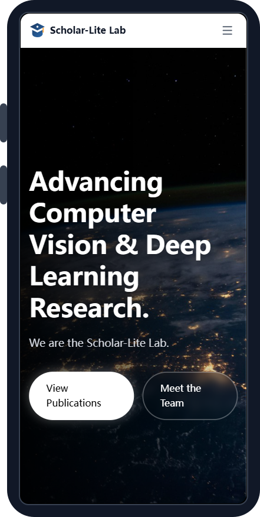
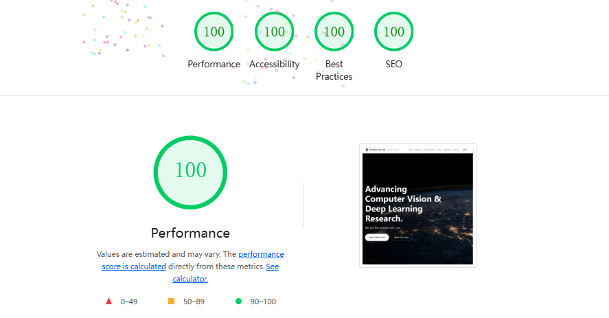

# 🎓 Scholar-Lite

<div align="center">


**[English](./README.md) | [简体中文](./README.zh-CN.md)**

> ## **⚡ 30秒极速建站**
> ```bash
> npm create astro@latest -- --template fjd2004711/scholar-lite
> ```

<p align="center">
  <a href="https://app.netlify.com/start/deploy?repository=https://github.com/fjd2004711/scholar-lite" target="_blank">
    
  </a>
  <a href="https://vercel.com/new/clone?repository-url=https://github.com/fjd2004711/scholar-lite" target="_blank">
    
  </a>
</p>

**为学术实验室与学者打造的下一代静态网站模板。**
*极速响应、零配置 BibTeX 导入、内置多语言检索引擎。*

---

## 🚀 30秒上手指南 (无需编程)

1.  **点击** 上方的 `部署到 Netlify` 或 `部署到 Vercel` 按钮。
2.  **等待** 部署完成。
3.  **前往** 您的新 GitHub 仓库，找到 `citations.bib` 文件。
4.  **上传** 您自己的 BibTeX 文件并覆盖它。
5.  **搞定！** 您的网站将在 1 分钟内自动更新。

---

<div align="center" style="margin-top: 20px;">
  <table>
    <tr>
      <td align="center">
        <a href="https://scholar-lite-demo.netlify.app/" target="_blank">
          
        </a>
        <br />
        <strong>在线预览</strong>
      </td>
      <td align="center">
        <a href="https://github.com/fjd2004711/scholar-lite" target="_blank">
          
        </a>
        <br />
        <strong>代码仓库</strong>
      </td>
    </tr>
  </table>
</div>

<div align="center">
  
  
</div>

</div>

---

## 🚀 为什么选择 Scholar-Lite？

### ⚡ 极致性能
*   **默认零 JS (Zero JS)**：基于 **Astro v6** 构建，内容页面向客户端发送 **0kb** JavaScript，实现秒级加载。
*   **Lighthouse 满分**：开箱即用的性能、可访问性、SEO 优化，均达到 Google Lighthouse 100/100 评分。
*   **Tailwind CSS v4**：采用最新的原子化 CSS 框架，样式开发从未如此高效。

<p align="center">
  
</p>

### 🤖 智能自动化
*   **一键 BibTeX 导入**：告别手动复制粘贴。只需放入 `citations.bib` 并运行一条命令，即可生成精美的论文列表。
*   **智能解析**：自动提取 **PDF 链接**、**代码仓库**、**项目主页**、**视频演示**、**封面图片**，并智能清理 Zotero 等软件导出的冗余路径。
*   **资源管理**：内置封面图回退机制，缺失图片时自动使用默认封面，确保布局整洁。
*   **自动荣誉徽章**：自动根据 BibTeX 中的 `note` 字段识别 "Best Paper", "Oral" 等奖项并生成高亮徽章。

### 🌍 全球化视野
*   **多语言搜索引擎**：内置 **Pagefind** 静态搜索引擎，支持 **8 种语言**（中、英、日、韩、法、德、西、俄）的全文检索。
*   **i18n 国际化**：原生支持中英双语切换，类型安全的翻译管理。

---

## 🆚 对比：Scholar-Lite vs. Hugo Academic

| 特性 | 🎓 Scholar-Lite | 🐢 Hugo Academic (Wowchemy) |
| :--- | :--- | :--- |
| **技术栈** | **Astro v6 + React + Tailwind v4** (现代主流) | Hugo + Go 模板 (学习曲线陡峭) |
| **性能** | **Lighthouse 100分** (默认零 JS) | 良好，但常因 JS 过重而臃肿 |
| **BibTeX 导入** | **零配置** (拖入 `citations.bib` 即可) | 复杂的 Python 脚本 / 手动录入 |
| **定制化** | **组件化开发** (直接修改 `.astro` / `.tsx`) | 僵化的主题系统 (覆盖内部模板困难) |
| **多语言** | **原生 i18n + Pagefind** (8种语言搜索) | 支持不完整，搜索功能常失效 |
| **开发体验** | **毫秒级热更新 (HMR)** | 大型站点重建速度慢 |
| **生态系统** | **NPM / Node.js** (百万级插件生态) | Go Modules (Web 相关包有限) |

---

## 🛠️ 快速开始

### 环境要求
*   Node.js v22.12.0 或更高版本

### 1. 安装
```bash
git clone https://github.com/your-repo/scholar-lite.git
cd scholar-lite
npm install
```

### 2. 开发模式
启动带有热更新的本地服务器：
```bash
npm run dev
```
访问 `http://localhost:4321`。

### 3. 生产构建
生成静态网站文件及搜索索引：
```bash
npm run build
```
*注意：搜索索引仅在构建时生成，因此搜索功能需要运行 build 后才能完整体验。*

---

## 📚 智能论文与著作管理

Scholar-Lite 在 `scripts/import-bibtex.js` 中内置了强大的 **BibTeX 导入引擎**，支持**论文**与**书籍**的一键导入。

### 如何导入
1.  **导出 BibTeX**：从 Zotero、Mendeley 或 Google Scholar 导出您的文献为 `citations.bib`。
2.  **放置文件**：将 `citations.bib` 文件保存到项目根目录。
3.  **运行导入**：
    ```bash
    npm run import-bibtex
    ```
4.  **自动分类**：系统会自动识别 BibTeX 中的类型：
    *   `@article`, `@inproceedings` 等 -> 导入到 **论文列表** (`src/content/publications`)
    *   `@book` -> 导入到 **著作列表** (`src/content/books`)

### 高级 BibTeX 特性

导入器会自动将 BibTeX 字段映射到网站布局，支持以下智能行为：

| BibTeX 字段 | 网站元素 | 智能行为 |
|-------------|----------|----------|
| `cover`/`image` | 封面图片 | 自动检测 `src/assets/` 下的文件。**书籍强烈建议设置此字段**。 |
| `publisher` | 出版社 | 书籍的 `publisher` 字段会自动显示在 venue 位置。 |
| `pdf`/`url`/`file` | PDF 按钮 | 自动清洗 Zotero 文件路径格式（如 `files/mypaper.pdf`）。 |
| `code`/`github` | 代码按钮 | 识别代码仓库链接，生成 GitHub/Code 按钮。 |
| `website`/`project` | **项目主页** | 识别项目主页链接，生成地球仪图标按钮。 |
| `demo` | **在线演示** | 生成 Demo 按钮（支持 Web App / HuggingFace / 视频链接）。 |
| `video`/`recording` | **视频** | 生成视频播放链接按钮。 |
| `slides`/`ppt` | **幻灯片** | 生成 PPT 下载按钮。 |
| `award`/`note` | **荣誉徽章** | 自动生成“最佳论文”（金色）、“口头报告”（蓝色）等高亮标签。 |

### BibTeX 条目示例

#### 1. 论文 (Paper)
```bibtex
@article{gpt4,
  title={GPT-4 Technical Report},
  author={OpenAI},
  year={2024},
  journal={ArXiv},
  url={https://arxiv.org/pdf/2303.08774.pdf},
  code={https://github.com/openai/evals},
  cover={../../assets/gpt4-cover.jpg},
  note={Tech Report}
}
```

#### 2. 书籍 (Book)
只需要将类型设置为 `@book`，系统会自动将其放入“著作”板块。
```bibtex
@book{deeplearning,
  title={Deep Learning},
  author={Goodfellow, Ian and Bengio, Yoshua and Courville, Aaron},
  publisher={MIT Press},
  year={2016},
  url={http://www.deeplearningbook.org},
  cover={../../assets/book-deep-learning.jpg}
}
```

---

## 🌟 最佳实践

### 📁 目录结构建议
*   **图片资源**: 建议存放于 `src/assets/images/`。使用 `.webp` 或压缩后的 `.jpg` 格式以获得最佳性能。
*   **团队照片**: 成员头像建议存放于 `src/assets/team/`，推荐使用 1:1 方形裁剪。
*   **内容文件**: 所有可编辑内容（新闻、团队、研究方向）均位于 `src/content/` 目录下。

### 📝 内容管理技巧
*   **新闻动态**: 在 `src/content/news/` 添加新的 Markdown 文件。文件名不影响排序，系统会自动根据 frontmatter 中的 `date` 字段排序。
*   **团队成员**: 在 `src/content/team/` 添加成员。使用 `weight` 字段控制显示顺序（数字越小越靠前）。
*   **研究方向**: 在 `src/content/research/` 添加 Markdown 文件。使用 `order` 字段控制显示顺序。
*   **多语言文案**: 修改 `src/i18n/ui.ts` 可自定义导航栏、按钮等界面元素的翻译。

### 🎓 更多学术成果管理
除了论文和书籍，系统还支持以下学术成果的管理。直接在对应文件夹中创建 Markdown 文件即可。

#### 1. 软件著作权 (Software Copyrights)
*   **位置**: `src/content/softwares/`
*   **示例**:
    ```markdown
    ---
    title: "智能图像处理系统 V1.0"
    developers: ["张三", "李四"]
    number: "2023SR123456"
    date: 2023-06-15
    description: "基于深度学习的自动化图像处理平台。"
    ---
    ```

#### 2. 发明专利 (Invention Patents)
*   **位置**: `src/content/patents/`
*   **示例**:
    ```markdown
    ---
    title: "一种基于注意力机制的图像识别方法"
    inventors: ["张三", "王五"]
    number: "CN102345678B"
    date: 2024-01-20
    status: "Granted" # 可选: Granted(已授权), Pending(实审中), Filed(已受理)
    ---
    ```

#### 3. 集体荣誉 (Group Honors)
*   **位置**: `src/content/honors/`
*   **示例**:
    ```markdown
    ---
    title: "第十八届挑战杯全国大学生课外学术科技作品竞赛"
    award: "特等奖"
    date: 2023-10-30
    year: "2023"
    type: "Challenge Cup"  # 可选: Challenge Cup, Internet+, Other
    level: "Special"       # 可选: Special(特等), First(一等), Second(二等), Third(三等)
    ---
    ```

### 🖼️ 图片优化
Scholar-Lite 会自动优化从 `src/assets/` 导入的图片。
*   **避免**: 将大图直接放在 `public/` 目录下（这会绕过构建优化）。
*   **推荐**: 在 Markdown 或 Astro 组件中引用图片，享受自动压缩、格式转换和懒加载特性。

---

## 🚢 部署指南

Scholar-Lite 是纯静态网站，可以部署在任何静态托管服务上。

### 推荐平台

| 平台 | 全球访问速度 | 易用性 | 成本 |
|----------|----------------|---------------|------|
| **Cloudflare Pages** | ⭐⭐⭐⭐⭐ | ⭐⭐⭐⭐⭐ | 免费 |
| **Vercel** | ⭐⭐⭐⭐⭐ | ⭐⭐⭐⭐⭐ | 免费 |
| **Netlify** | ⭐⭐⭐⭐ | ⭐⭐⭐⭐⭐ | 免费 |
| **GitHub Pages** | ⭐⭐⭐ | ⭐⭐⭐⭐ | 免费 |

### Cloudflare Pages / Vercel / Netlify
1.  在平台控制台连接您的 GitHub/GitLab 代码仓库。
2.  **构建命令 (Build Command)**: `npm run build`
3.  **输出目录 (Output Directory)**: `dist`
4.  点击部署即可。

### GitHub Pages / GitLab Pages
本项目已包含 CI/CD 配置文件（`.github/workflows` 和 `.gitlab-ci.yml`），推送到代码仓库后会自动触发构建并发布到 GitHub/GitLab Pages。

---

<div align="center">

**[Scholar-Lite Team](https://github.com/fjd2004711)**
<br>
*用现代 Web 技术赋能学术研究。*

</div>
