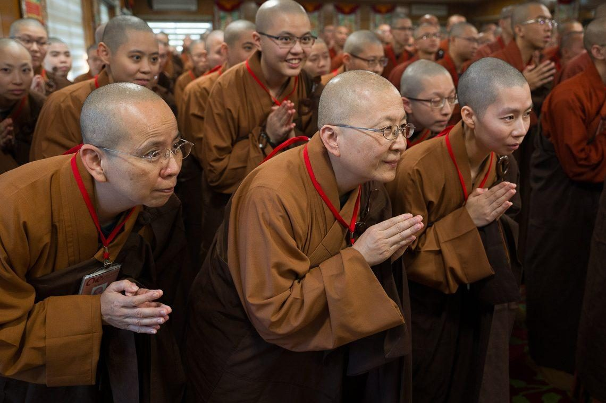
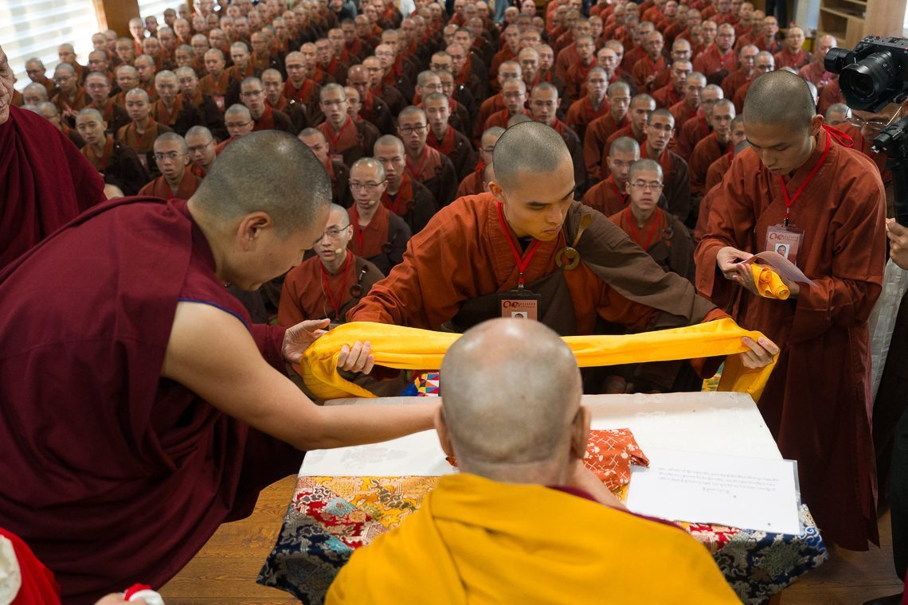
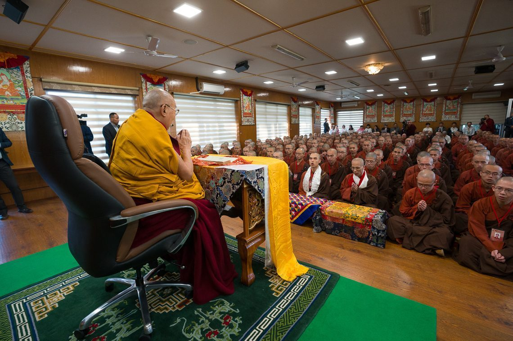
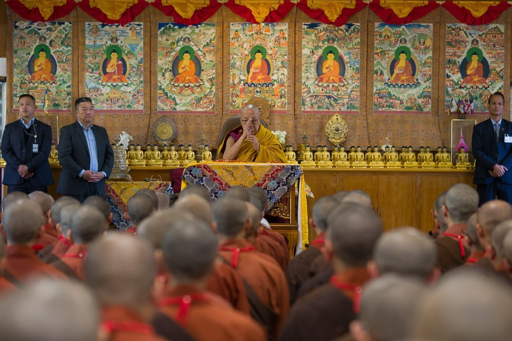
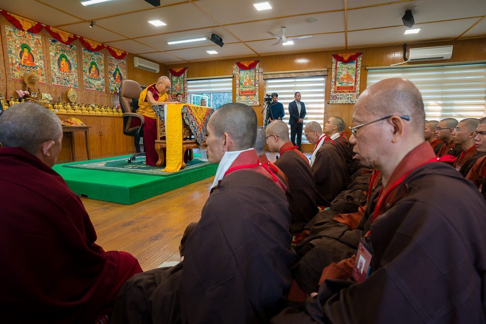
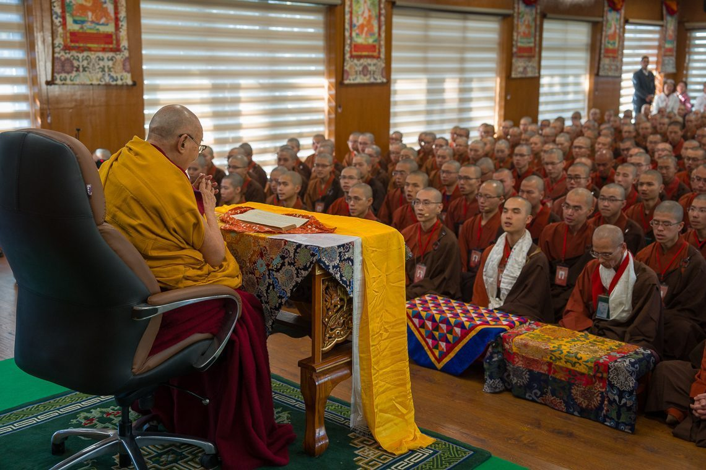
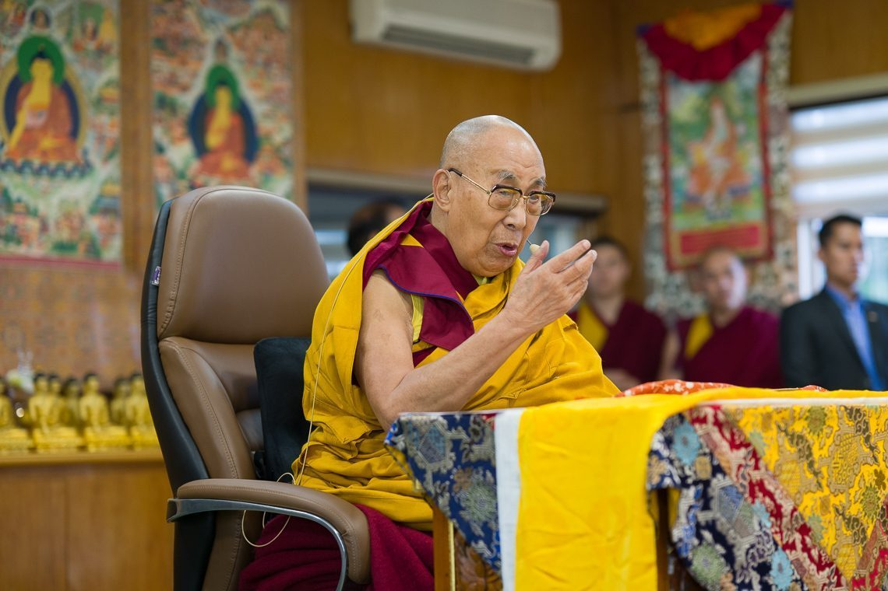
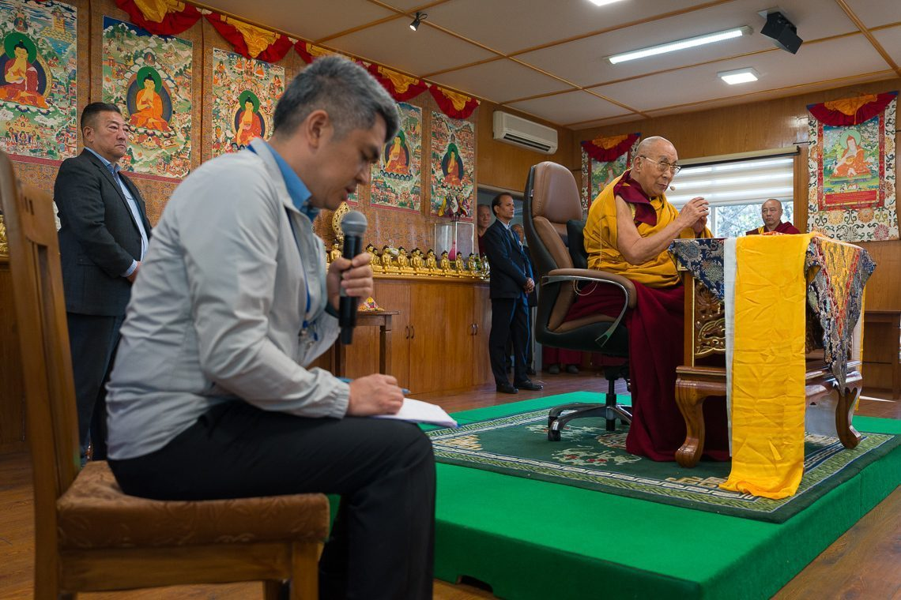
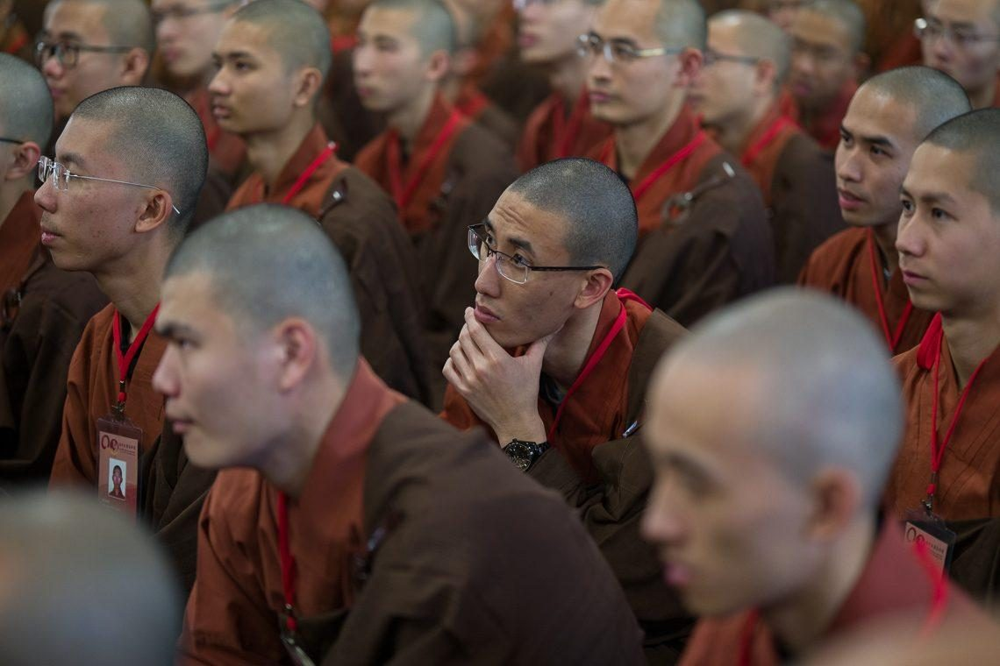
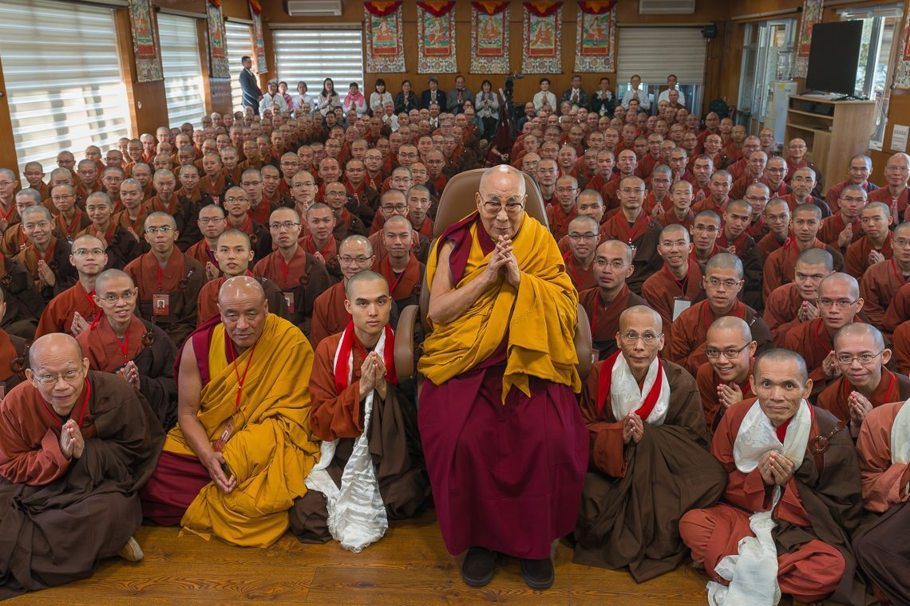

On November 19, 2025, a special prayer program was held at the hall in his residence in Dharamsala, HP, India, where over 240 monks and nuns from GEBIS and GWBI gathered to recite Je Tsongkhapa's "Essence of True Eloquence" (Lekshe Nyingpo) in Tibetan.

  

Monks and nuns attentively await His Holiness’s arrival in the prayer hall.

  

At the commencement of the prayer ceremony, Venerable Qing Cheng, representing GEBIS, presented traditional gifts to His Holiness.

  

His Holiness joins the monks and nuns in reciting the “Essence of True Eloquence.”

  

Monks and nuns chanting the “Essence of True Eloquence” in a solemn gathering.

  

The recitation continues with monks and nuns fully focused.

  

Monks and nuns chanting the “Essence of True Eloquence” in a solemn gathering.

  

His Holiness addresses the assembly, sharing teachings and blessings.

  

A Mandarin interpreter conveys His Holiness’s words to the audience.

  

A monk listens attentively to His Holiness’s guidance.

  

Group photo of monks, nuns, and His Holiness after the prayer program.

  

<iframe width="800" height="450" src="https://www.youtube.com/embed/d0MgQPkNZjQ?si=I8MZqwtZh0wMY5Vs" title="YouTube video player" frameborder="0" allow="accelerometer; autoplay; clipboard-write; encrypted-media; gyroscope; picture-in-picture; web-share" referrerpolicy="strict-origin-when-cross-origin" allowfullscreen></iframe>

