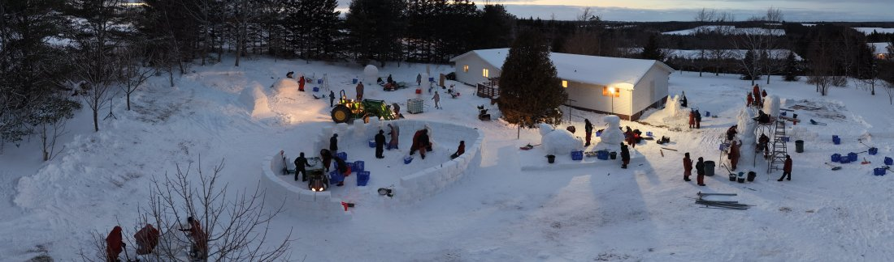
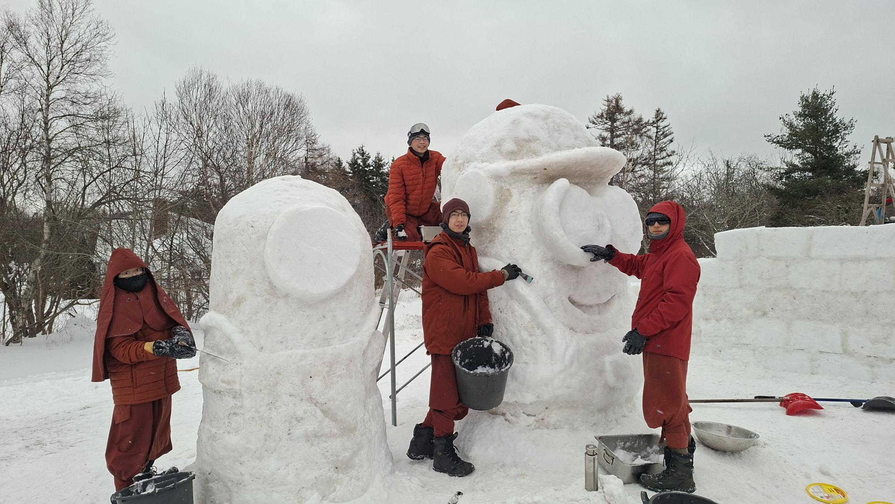
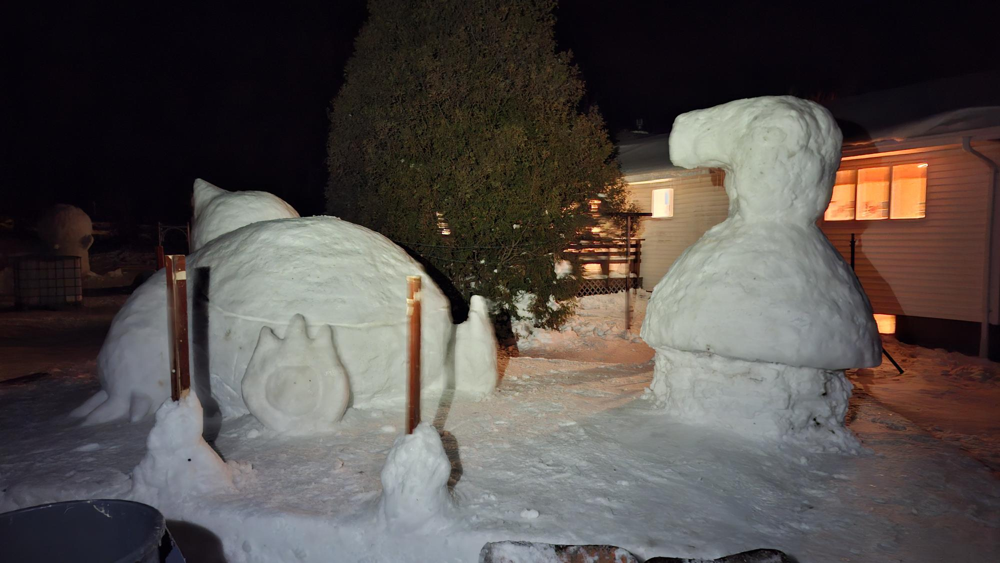
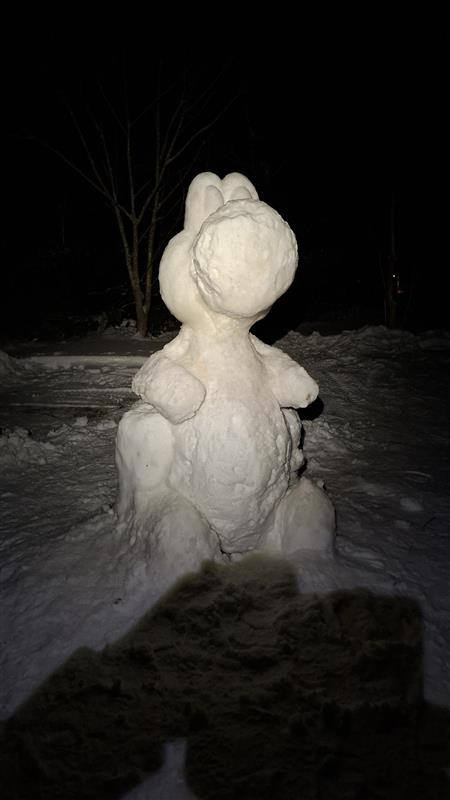
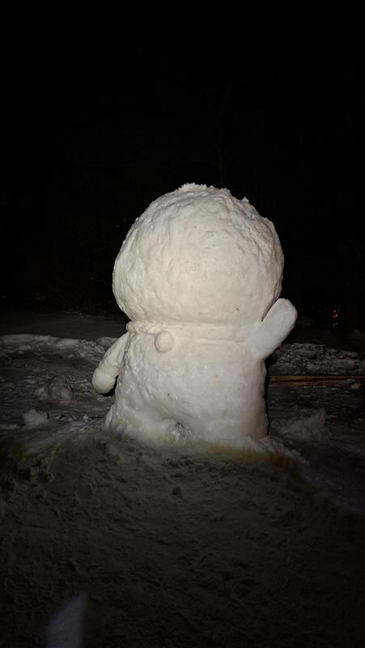
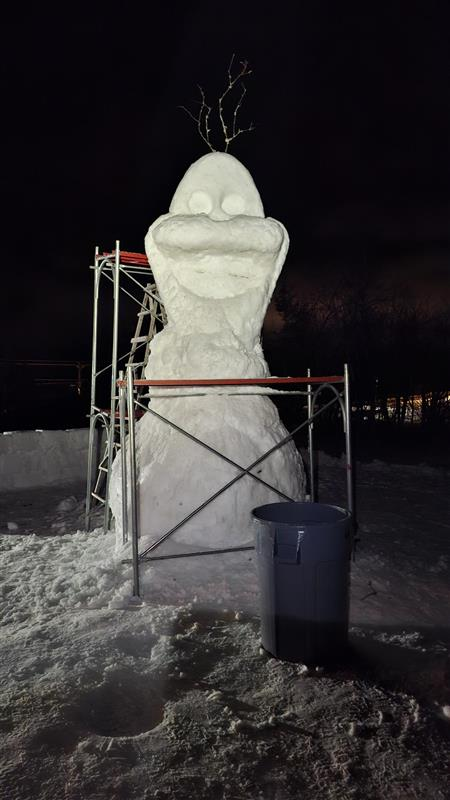
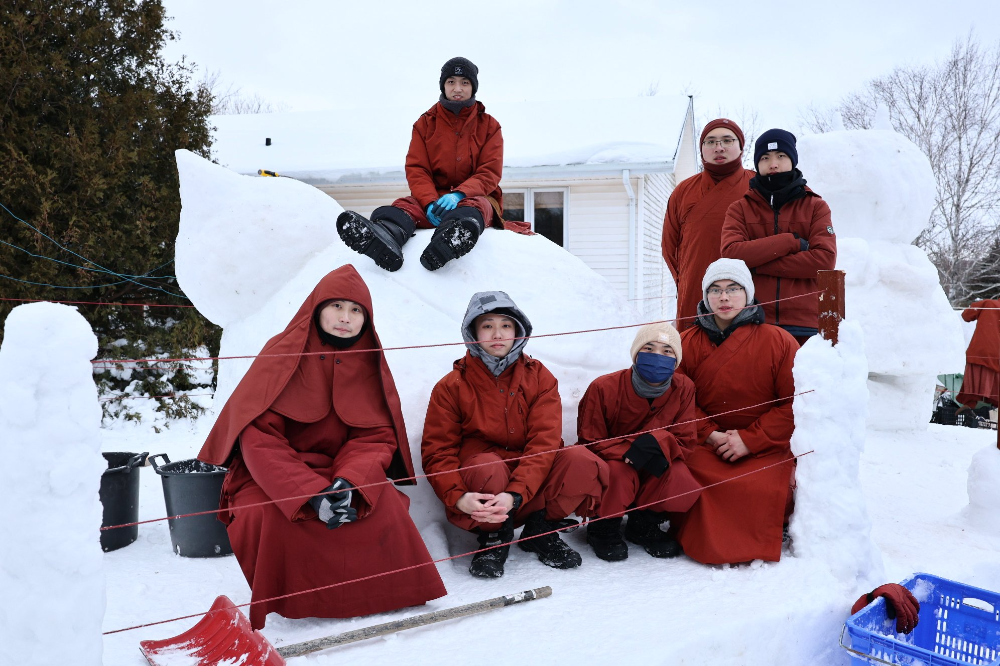

After the successful conclusion of the Five Major Treatises exam on January 30th, with two weeks remaining until Chinese New Year's Eve (February 16th),
the monks had a sudden inspiration: Let's create some joy in the snow, adding festive cheer and laughter to PEI.

Thus, over 100 monks braved sub-zero temperatures for three consecutive days,
shoveling and sculpting snow by hand to create a snowman world that invites people to pause, smile, and wander.

  

As night fell, the entire grounds were illuminated. Over a hundred monks worked feverishly in coordinated teams. In the distance, tractors and bustling figures wove a heartwarming scene of festive preparations.

  

Minions, wearing protective goggles, “officially begin work” after their final exam. Monks meticulously carve intricate details onto them.

  

Gru sits elegantly with his signature expression, showcasing the extraordinary skill of snow sculpture craftsmanship. Using simple tools, the masters carve distinctive works of art in the frigid world.

  

A monk meticulously shapes Snorlax's pointed ears, with swirling snowflakes bearing witness to the intricate craftsmanship. From rough ice blocks to vivid characters, every curve embodies the monks' unwavering focus and creativity in the bitter cold.

  

Peppa Pig radiates warmth against the night sky, her rounded lines brimming with childlike charm. For neighborhood children, this is undoubtedly the most beloved surprise gift of this winter.

  

Nintendo's classic character Yoshi joins the snowy party, his agile demeanor vividly brought to life, adding a vibrant spark to the chilly PEI.

  

The round and plump Doraemon waves his little round hands, as if greeting every visiting neighbor.

  

Towering Olaf stands beside scaffolding, flashing his signature smile. The tree branches adorning his hair are a standout feature.

  

The artists pose with the hand-built Snorlax, each face beaming with the satisfaction of a job well done.

  

<iframe src="https://www.youtube.com/embed/TquUZaYR7FA" width="800" height="450" style="border:none;overflow:hidden" scrolling="no" frameborder="0" allowfullscreen="true" allow="autoplay; clipboard-write; encrypted-media; picture-in-picture; web-share" allowFullScreen="true"></iframe>

It's been bitterly cold these days—
Morning lows hit -18°C, and while afternoons reached -6°C, the wind cut straight through you.
Monk robes, padded jackets, and long coats all came out, but the only thing that kept us warm from head to toe was... insulated coveralls.

A little one braved the outdoors for 3 hours, drank three cups of hot cocoa, yet still shivered uncontrollably, and was finally “ordered” back indoors to warm up.
Everyone returning had rosy cheeks and red hands.
Some frantically blew their feet with hair dryers, while others laughed, “Just grabbing snow makes your whole body freeze.”

But precisely because of this,
this snowy field was filled with laughter, mutual care, and warmth.

When the sun emerged, the snow glistened,
making not only the snowmen beautiful, but the children's eyes sparkle too.

We sincerely invite neighbors and friends:
📍 Come take a stroll
📍 Come see
📍 Feel simple, genuine joy in the snow

This isn't just a snow sculpture—
it's a **New Year blessing we wish to share with everyone.**

(Also quietly noting: If we do this again next year, we must prepare all warm gear—equipment truly impacts happiness and efficiency!)

