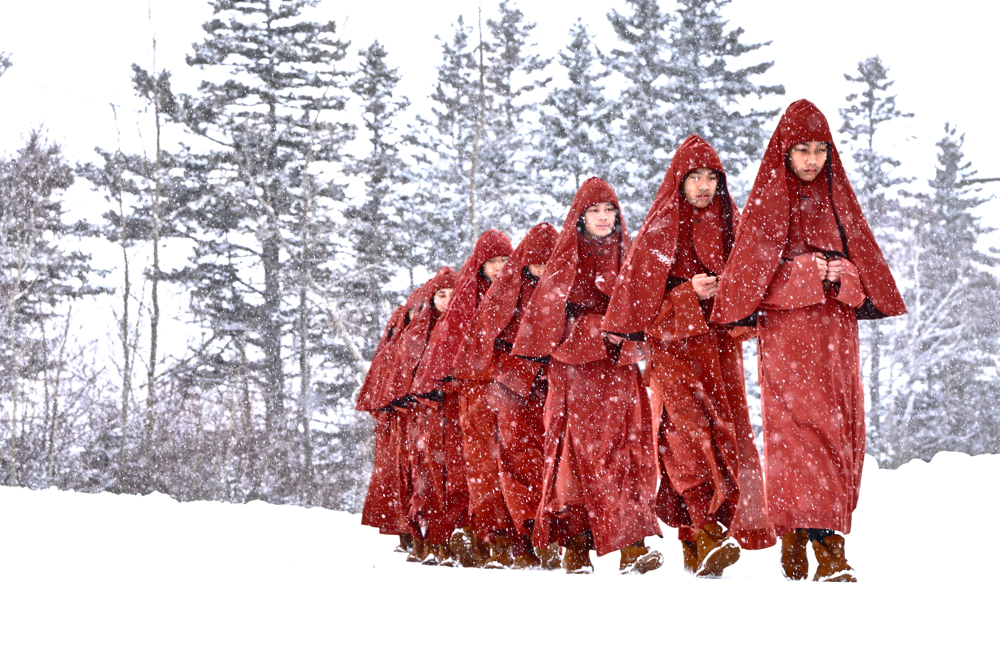
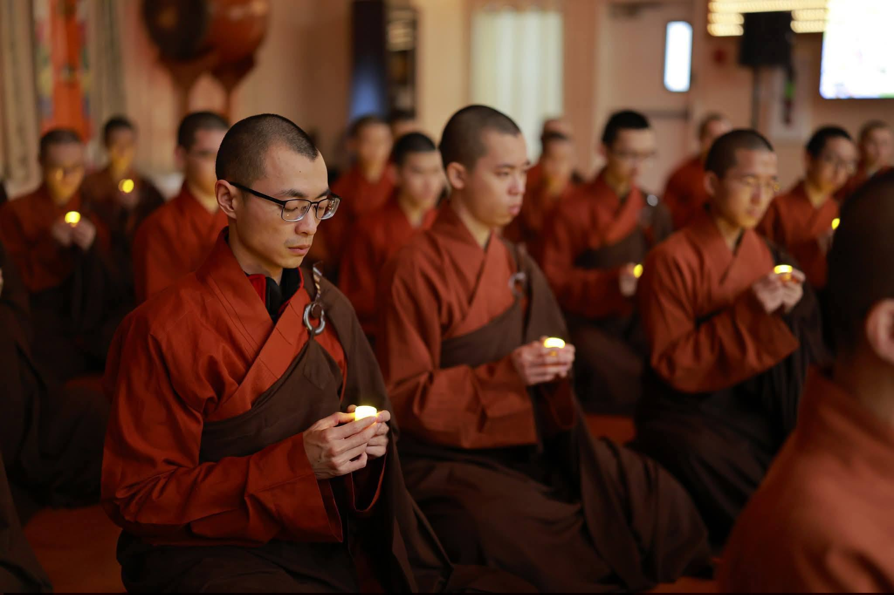
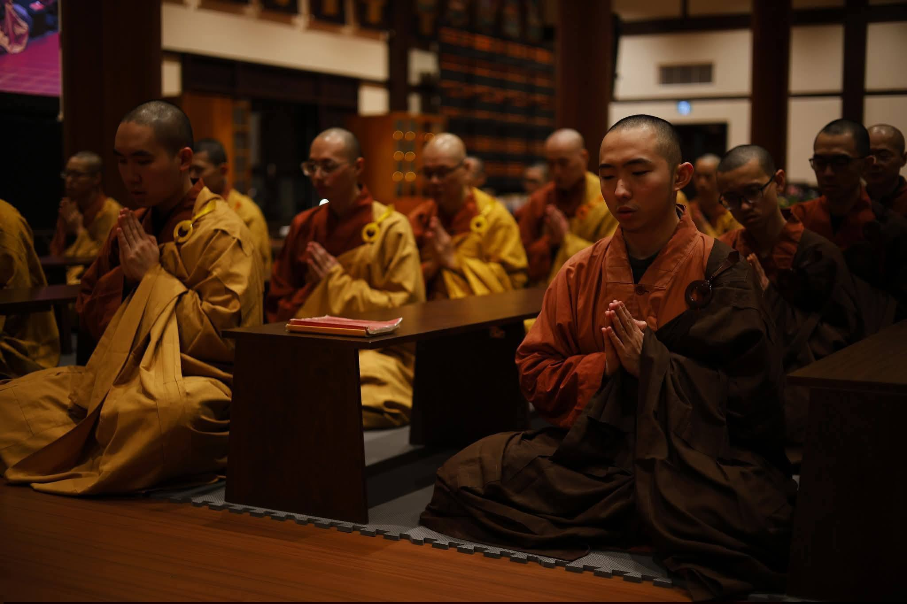

When tragedy struck, the GEBIS Sangha immediately set aside their scheduled Winter Joy in the Snow activities and came together in prayer. They demonstrated the Buddhist values of peace, compassion, and fearlessness by offering the community immediate spiritual support and heartfelt blessings in its darkest hour.

  

<iframe width="800" height="450" src="https://www.youtube.com/embed/lNLVnA1sL0I?si=atZwuv02_y_4ulA2" title="YouTube video player" frameborder="0" allow="accelerometer; autoplay; clipboard-write; encrypted-media; gyroscope; picture-in-picture; web-share" referrerpolicy="strict-origin-when-cross-origin" allowfullscreen></iframe>

<iframe width="800" height="450" src="https://www.youtube.com/embed/INhOah3ji0U?si=2r7MTvK4eAn4yXJp" title="YouTube video player" frameborder="0" allow="accelerometer; autoplay; clipboard-write; encrypted-media; gyroscope; picture-in-picture; web-share" referrerpolicy="strict-origin-when-cross-origin" allowfullscreen></iframe>