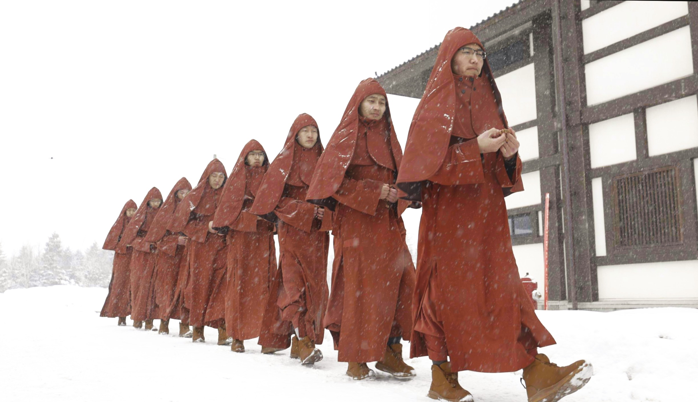
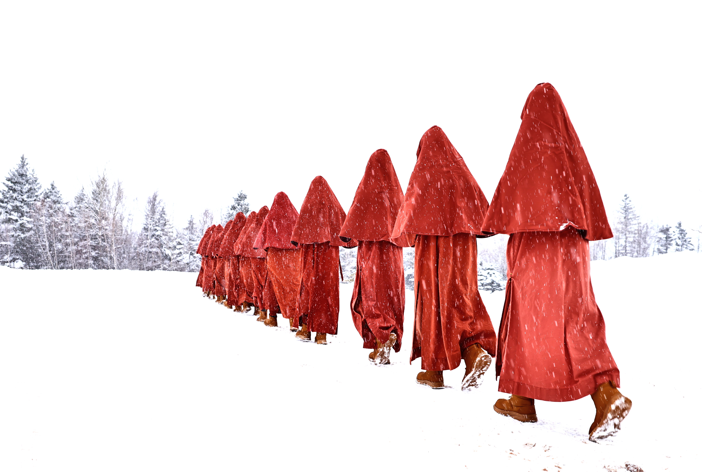

When tragedy struck, the GEBIS Sangha immediately set aside their scheduled activities and came together in prayer. They demonstrated the Buddhist values of peace, compassion, and fearlessness by offering the community immediate spiritual support and heartfelt blessings in its darkest hour.

  

 

 

