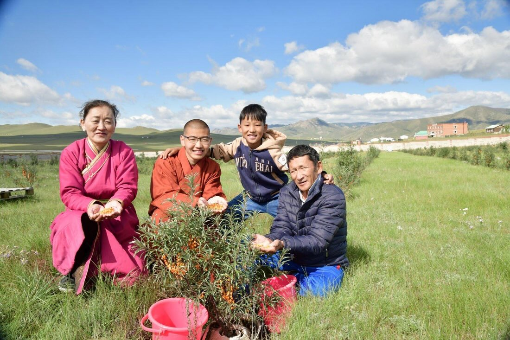
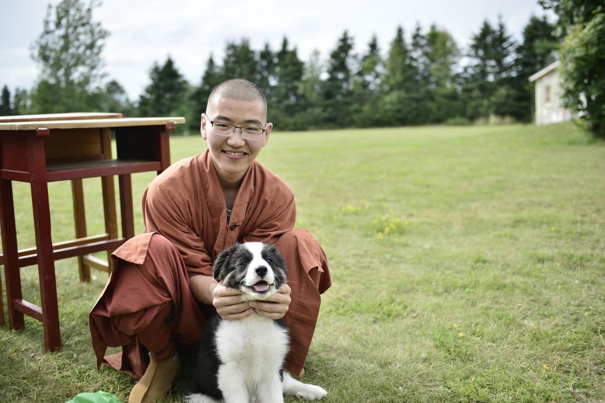
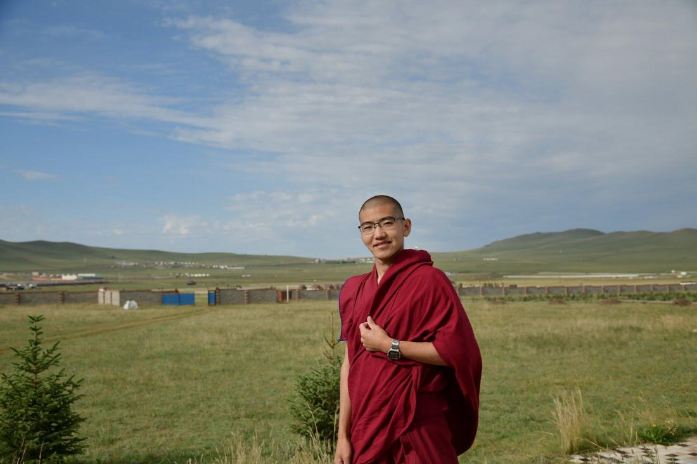
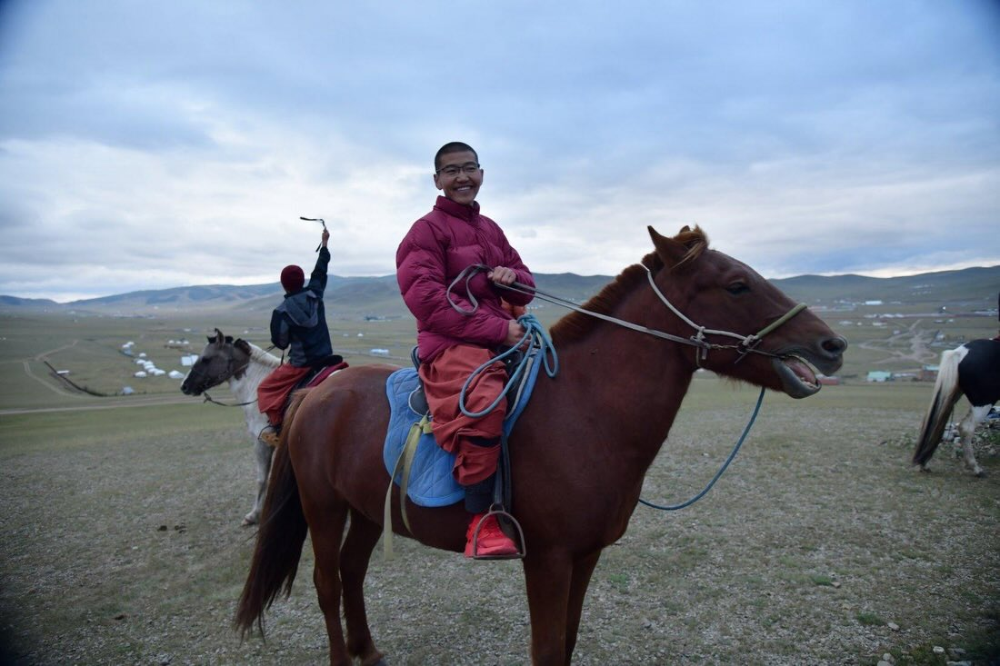

Members of GEBIS are participating in the 2026 CMHA Push-Up Challenge. You may remember the Mongolian athletes from Netflix's Physical: 100 Asia, who are known for their quiet endurance and steady strength. This week, we've seen that same spirit here on Prince Edward Island.   
One of our young monks from Mongolia in his twenties completed 2,000 push-ups over three days as part of the challenge. No competition. No spotlight. Just consistent effort. For him, physical training supports mental clarity. Repetition builds focus. Endurance builds resilience—qualities that matter deeply in conversations about mental health.  
His name is Radnaabazar Tumursukh. "Radnaa" has Sanskrit roots associated with awakening. "Bazar" relates to the Vajra, which symbolizes resilience. "Tumursukh," meaning "Silver Axe," is his family name.  
Small efforts, done steadily, can support something larger. Thank you for standing with us in caring for mental well-being.

 

<iframe width="800" height="450" src="https://www.youtube.com/embed/gHUNTS8F6ao?si=mLs2isIbCFUONrFR" title="YouTube video player" frameborder="0" allow="accelerometer; autoplay; clipboard-write; encrypted-media; gyroscope; picture-in-picture; web-share" referrerpolicy="strict-origin-when-cross-origin" allowfullscreen></iframe>

  
🌟 From the Mongolian grasslands to The Push-Up Challenge 🌟
   
I’m Gordon — DASHCHIREV AMARJARGAL.
Every day, I do 130 push-ups. Some days are tough. But when I remember why I’m doing this, the weight feels lighter.
   
This isn’t just about fitness.
It’s about supporting those facing depression. It’s about strengthening body and mind. It’s about contributing, in my own small way, to world peace.
   
My name DASHCHIREV means “auspicious rotation,” like a right-turning conch — a symbol of peace and positive influence. My great-grandmother chose it, hoping I would help spread goodness in the world. 
AMARJARGAL, from my mother’s name, means “peace and happiness.”
   
I grew up riding horses and wrestling on the vast Mongolian grasslands. Strength was part of life. But this challenge isn’t about muscles.
   
True strength is the heart.
True resilience is the mind.
   
130 push-ups a day — not to show power,
but to build peace from within.
  

